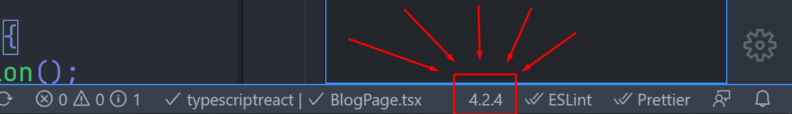
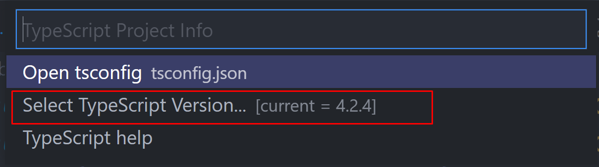
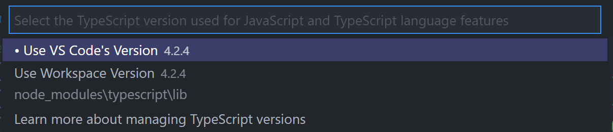

Are you a TypeScript user, who's using CSS modules and ever ran into this little problem where you type `styles.` and expect the list of classes to show up in your VSCode intellisense, but it doesn't?

After going through this article, you'll have this super sweet intellisense like shown below 👇


And the fun part is, you won't need to install any VSCode extensions for this.

# Prerequisites

1. **VSCode** - VSCode has TypeScript built in, which is what's gonna make this feature work. Not sure about Vim or Sublime though, if they'll support this 😅

2. **Locally installed TypeScript** - There must be TypeScript locally installed and present in your `package.json` (Preferably the latest version 😁)

3. **Grit and Debugging skills 😉** - Well, it is a prerequisite for writing every single line of code as a dev, donchya agree?

# The best way

Here's the best and most optimal way to set this up

## <mark>npm install typescript-plugin-css-modules</mark>

Install this little npm package, preferably as a `devDependency` (-D).

```sh
npm i --save-dev typescript-plugin-css-modules

# Or if you're a yarn person

yarn add --save-dev typescript-plugin-css-modules
```

> And yeah, in case you were wondering, TypeScript does have its own plugin architecture. Heck, I myself found it only a month back, [when I moved a project of mine to CSS Modules from Styled Components](https://puruvj.dev/blog/move-to-css-modules-from-styled-components) 😅.

## Add to tsconfig.json

Open up your `tsconfig.json`, and add to the `compilerOptions` property this one liner:

```json
"plugins": [{ "name": "typescript-plugin-css-modules" }]
```

## Set VSCode TypeScript version

This one is superrrrrr important. The TypeScript version your VSCode uses should be the local version(The one installed in your project locally), otherwise this whole song and dance of installing plugins and setting config will be worthless.

Open a `.ts` or `.tsx` file in VSCode, On bottom left you'll see this little option 👇



This is your TypeScript version. Click on it, and a list popup will open on the very top 👇



Click on <mark>Select TypeScript Version</mark>. That will show these options 👇



As you can see, I have <mark>Use VS Code's Version</mark> selected(Look at the white dot before). Click on <mark>Use Workspace Version</mark>, and you are all set.

Enjoy the amazing Intellisense 😀
