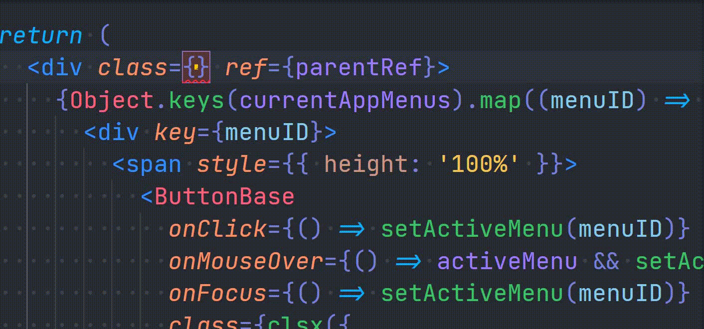

Are you a TypeScript user, who's using CSS modules and ever ran into this little problem where you type `styles.` and expect the list of classes to show up in your VSCode intellisense, but it doesn't?

After going through this article, you'll have this super sweet intellisense like shown below 👇



And the fun part is, you won't need to install any VSCode extensions for this.

# Prerequisites

1. **VSCode** - VSCode has TypeScript built in, which is what's gonna make this feature work. Not sure about Vim or Sublime though, if they'll support this 😅

2. **Locally installed TypeScript** - There must be TypeScript locally installed and present in your `package.json` (Preferably the latest version 😁)

3. **Grit and Debugging skills 😉** - Well, it is a prerequisite for writing every single line of code as a dev, donchya agree?

# The best way

Here's the best and most optimal way to set this up

## <mark>npm install typescript-plugin-css-modules</mark>

Install this little npm package, preferably as a `devDependency` (-D).

```sh
npm i --save-dev typescript-plugin-css-modules

# Or if you're a yarn person

yarn add --save-dev typescript-plugin-css-modules
```

> And yeah, in case you were wondering, TypeScript does have its own plugin architechture. Even I found it a month back, [when I moved a project of mine to CSS Modules from Styled Components](https://puruvj.dev/blog/move-to-css-modules-from-styled-components) 😅
